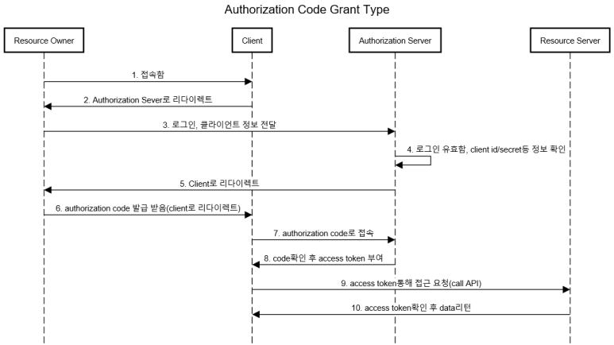
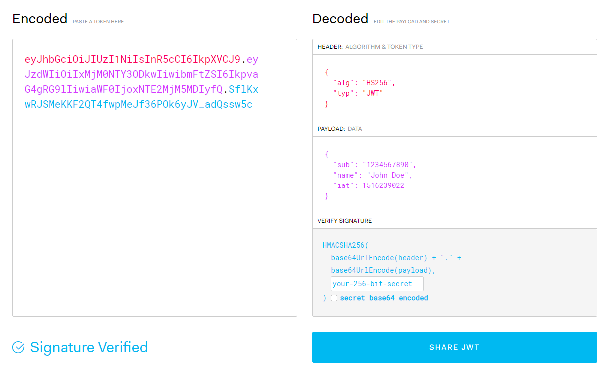

# Introduction

### Oauth2-Authorization-Server
> Authorization Code 방식의 Oauth2.0 API Server 가상 구현

`SpringBoot` `lombok` `JPA` `H2`

 

- JWT 토큰 기반 구현
- 테스트를 위한 간단한 Resource Server API 포함
- 아쉽게도 프론트엔드 컴포넌트 X

 

### Update History

#### v1.0 [2022-03-31]
###### - 전체 Flow 반영된 초기버전 완성(예정)

 
 

## What is Oauth2 ?

OAuth는 인터넷 사용자들이 비밀번호를 제공하지 않고 다른 웹사이트 상의 자신들의 정보에 대해 웹사이트나 애플리케이션의 접근 권한을 부여할 수 있는 공통적인 수단으로서 사용되는, 접근 위임을 위한 개방형 표준이다. 이 매커니즘은 여러 기업들에 의해 사용되는데, 이를테면 아마존, 구글, 페이스북, 마이크로소프트, 트위터가 있으며 사용자들이 타사 애플리케이션이나 웹사이트의 계정에 관한 정보를 공유할 수 있게 허용한다.  OAuth 는 현재 2.0 이 가장 최신 버전이다.
[좀더 자세한 설명 링크](https://blog.naver.com/good_ray/222023798182)

 
 

#### OAuth 에 대해 정리하자면 다음과 같다.
1. 리소스에 대한 접근 권한을 인가하는 표준화 된 방식이다.
2. ID/PW 직접 교환하지 않아도 되므로 신뢰할 수 없는 서비스에 개인정보를 제공할 필요가 없다. (Token 방식)
3. Token 만 있으면 다른 절차는 불필요하다.

 

#### OAuth 용어들
- 자원 소유자 (Resource Owner) : 보호된 자원에 대한 접근권한을 위임해 줄 수 있는 주체. 사람일 경우 사용자.
- 클라이언트 (Client) : 자원 소유자의 허가를 받아 보호된 자원에 접근하려는 어플리케이션.
- 인증 서버 (Authorization Server) : 자원 소유자의 인증 및 클라이언트의 권한 획득이 끝나면, 액세스 토큰을 발급해 주는 서버. (인증 서버와 자원 서버는 분리할 수도 있고, 하나의 서버가 두 역할을 할 수도 있다.)
- 자원 서버 (Resource Server) : 보호된 자원을 가지고 있는 서버. 액세스 토큰을 가진 요청에 대해 자원을 제공해줄 수 있음.
- 접근 토큰(access token) : 인증 후에 클라이언트가 보호된 자원에 접근하기 위해 필요한 값.
- 리프레시 토큰(refresh token) : Access Token이 만료되었을 때 갱신하기 위해 필요한 값

 

#### Flows
</img>
 

1. 사용자가 client에 접속합니다.

 

2. 리다이렉트 할 때 문자열 매개변수에 다음을 포함합니다.

* `response_type` 권한 부여 방식에 대한 설정방식으로 대표적으로 'code'와 'token'이 있음(이 프로젝트는 'code'로 고정)

* `redirect_uri`  요청을 승인 한 후 사용자를 다시 보낼 위치를 OAuth 서버에 알림

* `client_id`     개발자가 어플리케이션을 처음 등록 할 때 얻은 어플리케이션의 공개 식별자

* `state`         (Optional)어플리케이션에서 임의의 문자열을 생성하고 요청에 포함시킵니다. 그런 다음 인증 후에 동일한 값이 반환되는지 확인해야한다. CSRF 공격 을 막는 데 사용됨

* `scope`         (Optional)어플리케이션이 요청한 사용 권한을 나타냄

3. 사용자가 로그인 정보를 전달합니다.(로그인 시도)

 

4. 로그인에 성공하면 2번에서 쿼리 스트링에 포함시켜 넘어온 client_id, redirect_uri등을 확인하여 일치하는지 확인합니다.

 

5. owner가 승인하면 client로 리다이렉트합니다.

 

6. client로 리다이렉트할 때 쿼리 매개변수에 다음을 포함합니다.

* `authorization code` OAuth 서버에서 만들어준 인증 코드

* `state`              (Optional) client에서 보낸 문자열 그대로 리턴

 

7. code를 통해 client가 authorization server에 직접 접근할 수 있게 됩니다. client가 POST요청을 보낼 때 쿼리 매개변수에 redirect_uri, grant_type, authorization을 포함합니다. client_id와 client_secret은 별도로 Base64 인코딩하여 생성하여 Authorization Basic 헤더에 넣어줍니다.

* `redirect_uri`       권한 서버가 요청에 대한 응답을 보낼 ur을 설정

* `grant_type`         Access Token 획득 요청 시 포함되는 값으로 권한 부여 방식에 대한 설정입니다.(grant_type은 'authorization_code'로 고정)

* `authorization code` OAuth 서버에서 만들어준 인증 코드

* `client_id`          개발자가 어플리케이션을 처음 등록 할 때 얻은 어플리케이션의 공개 식별자

* `client_secret`      이 값을 사용하면, access token을 얻으려는 요청이 어플리케이션에서만 이루어지며 인증 코드를 가로채는 잠재적인 공격자가 아닌 것이 보장된다.

 

8. code와 7번에서 받은 정보들을 확인하여 전부 일치하면 access token을 발급합니다. authorization server는 아래 내용을 포함하는 JSON파일로 응답합니다.

* `token_type`     발행된 Token의 타입(token_type은 'Bearer'로 고정)

* `expires_in`     토큰의 만료시간(초단위)

* `access_token`   Resource Server에 자원을 요청할 때 필요한 토큰

* `refresh_token`  access_token의 갱신용 토큰

 

9. client는 token을 통해 resource server에 직접 접근할 수 있게 됩니다.

 
 

## What is JWT ?
인터넷 표준 인증 방식 중 하나로 JWT를 많이 사용하기에 Access Token과 Refresh Token를 JWT를 이용하여 구현하는 것을 채택하였다. 따라서, JWT의 개념을 잠깐 짚고 넘어간다.

JWT(Json Web Token)란 Json 포맷을 이용하여 사용자에 대한 속성을 저장하는 Claim 기반의 Web Token이다. JWT는 토큰 자체를 정보로 사용하는 Self-Contained 방식으로 정보를 안전하게 전달한다. 주로 회원 인증이나 정보 전달에 사용되는 JWT는 아래의 로직을 따라서 처리된다.

 

####JWT 구조
</img>
 
JWT는 Header, Payload, Signature의 3 부분으로 이루어지며, Json 형태인 각 부분은 Base64로 인코딩 되어 표현된다. 또한 각각의 부분을 이어 주기 위해 . 구분자를 사용하여 구분한다. 추가로 Base64는 암호화된 문자열이 아니고, 같은 문자열에 대해 항상 같은 인코딩 문자열을 반환한다.
[참고사이트](https://jwt.io/)

 

######1. Header(헤더)
Header에는 보통 토큰의 타입이나, 서명 생성에 어떤 알고리즘이 사용되었는지 저장한다.
토큰의 헤더는 typ과 alg 두 가지 정보로 구성된다. alg는 헤더(Header)를 암호화 하는 것이 아니고, Signature를 해싱하기 위한 알고리즘을 지정하는 것이다.

- typ: 토큰의 타입을 지정 ex) JWT
- alg: 알고리즘 방식을 지정하며, 서명(Signature) 및 토큰 검증에 사용 ex) HS256(SHA256) 또는 RSA

######2. PayLoad(페이로드)
Payload에는 보통 Claim이라는 사용자에 대한, 혹은 토큰에 대한 property를 key-value의 형태로 저장한다.
등록된 클레임은 토큰 정보를 표현하기 위해 이미 정해진 종류의 데이터들로, 모두 선택적으로 작성이 가능하며 사용할 것을 권장한다. 또한 JWT를 간결하게 하기 위해 key는 모두 길이 3의 String이다. 여기서 subject로는 unique한 값을 사용하는데, 사용자 이메일을 주로 사용한다.

- iss: 토큰 발급자(issuer)
- sub: 토큰 제목(subject)
- aud: 토큰 대상자(audience)
- exp: 토큰 만료 시간(expiration), NumericDate 형식으로 되어 있어야 함 ex) 1480849147370
- nbf: 토큰 활성 날짜(not before), 이 날이 지나기 전의 토큰은 활성화되지 않음
- iat: 토큰 발급 시간(issued at), 토큰 발급 이후의 경과 시간을 알 수 있음
- jti: JWT 토큰 식별자(JWT ID), 중복 방지를 위해 사용하며, 일회용 토큰(Access Token) 등에 사용

표준 스펙 외에도 필요하다 싶으면 추가해도 무방하다. 다만 중요한 것은 payload에는 개인정보 등 민감한 정보를 담지 않는 것이다.

######3. Signature(서명)
서명(Signature)은 토큰을 인코딩하거나 유효성 검증을 할 때 사용하는 고유한 암호화 코드이다. 서명(Signature)은 위에서 만든 헤더(Header)와 페이로드(Payload)의 값을 각각 BASE64로 인코딩하고, 인코딩한 값을 비밀 키를 이용해 헤더(Header)에서 정의한 알고리즘으로 해싱을 하고, 이 값을 다시 BASE64로 인코딩하여 생성한다.
 
 

## Project
🙋 작업 중
 
 

### Database
🙋 작업 중
 
 

### End-points
🙋 작업 중
 
 
